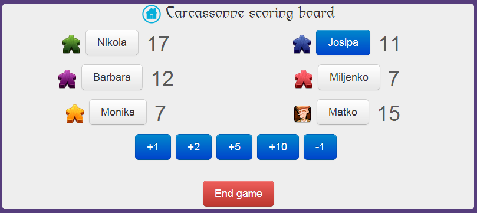
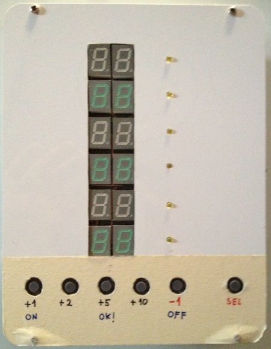
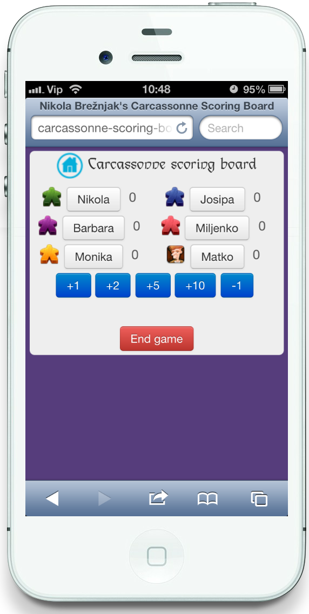

Carcassonne Scoring Board
=========================
Web app port of an electronic carcassonne scoring board  

How to use the code?
====================
First you have to clone it, then run **npm install** and **bower install** in the cloned folder for all the dependencies to install themselves:

    git clone https://github.com/Hitman666/carcassonne-scoring-board.git
    cd carcassonne-scoring-board
    npm install
    bower install

To test my application run

    grunt server

and you should see the application open in your browser.

Why?
====
Since I'm a big fan of [Carcassonne board game](http://boardgamegeek.com/boardgame/822/carcassonne) and I happen to come accross this [unique project](http://www.av-technologies.net/scoreboard/index.html) on the web, I just __had to__ make one for myself... It proved to be great for Carcassonne scoring, but just recently we started using it to track scores in [Qwirkle board game](http://boardgamegeek.com/boardgame/25669/qwirkle).

Here are some ([more on my blog](http://www.nikola-breznjak.com/blog/projects/carcassonne-scoring-board-application)) pictures of how my version of the electronic carcassonne counter looks like, and how the app looks like on iphone  
  

Idea?
=====

The idea for a web app came naturally since the electronic counter was too cumbersome to carry around. Now, since this project was done while I was learning (still am) [Angular.js](http://angularjs.org/), there is still a lot space for improvement (especially code structure and logic), that's why I encourage you to give suggestions on best (better) Angular practices, or even help out. Until then try out the application and give me your thoughts about it. Btw, the code here is free to use, I didn't put any restrictions on it so feel free to fork it, improve it, alter it to suit your needs.

The icons are from [The IconFactory](http://iconfactory.com/freeware/preview/cmap), and the font is [Lindsay Becker]](href="http://www.ufonts.com/fonts/lindsay-becker.html) in case you're wondering.

I would love to hear which game you used it to track scores for, so feel free to [leave a comment on my blog](http://www.nikola-breznjak.com/blog/projects/carcassonne-scoring-board-application).